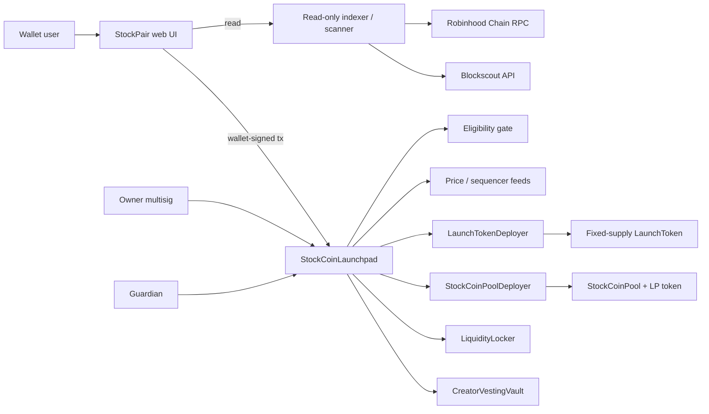

# Architecture

## On-chain components

### `StockCoinLaunchpad`

Non-upgradeable factory, registry, and policy boundary. It:

- creates only fixed-supply launch tokens and factory pools;
- restricts registered stocks to strict 18-decimal, non-proxy contracts with no delegatecall/callcode/selfdestruct or listed privileged selector surface;
- pins the runtime code hash at each registry configuration;
- validates launch-time oracle rounds and optional sequencer state;
- caps creator allocation at 10% and sends it to a 90-day-cliff/one-year linear vesting vault;
- enforces a one-year to four-year initial LP lock;
- applies optional eligibility checks to launches, swaps, additions, and ordinary removals;
- allows owner or guardian to pause and emergency-block stocks/pools;
- requires a 48-hour on-chain delay for configuration, restoration, guardian changes, and ownership-transfer initiation;
- allows only the owner to execute delayed restoration/configuration, while the guardian may cancel queued actions; and
- preserves self-directed LP exits during an incident.

### `LaunchToken`

Standard 18-decimal, immutable-supply ERC-20. There is no owner mint, tax, blacklist, pause, proxy, upgrade, or arbitrary callback surface.

### `StockCoinPool`

One immutable launch coin and one immutable approved stock token. It provides exact-input constant-product swaps and proportional LP operations with:

- 0–100 bps immutable pool fee;
- exact input/output balance-delta verification;
- minimum liquidity permanently burned;
- `uint112` reserve limits;
- slippage and deadline checks;
- post-swap invariant validation;
- a 5% input-reserve maximum swap size;
- self-recipient enforcement;
- reentrancy protection; and
- factory policy callbacks.

`sync()` only reconciles direct donations; there is no `skim()` withdrawal path.

### `CreatorVestingVault`

Immutable creator-allocation custody. Claims begin after a 90-day cliff, vest linearly for one year, and always pay the registered beneficiary.

### `LiquidityLocker`

Immutable initial-LP custody. The factory can register only LP already held by the locker. Only the recorded beneficiary can claim after expiry.

## Read-side components

### Indexer

The service has no signing key and no transaction-relay endpoint. It reads:

- launchpad and pool state;
- approved stock registry state;
- launches, swaps, liquidity, and emergency events;
- wallet balances and LP positions; and
- explorer verification/holder metadata.

The API is rate-limited, CORS allowlisted, no-store, and served with restrictive security headers. Production hosting should place it behind an authenticated observability layer and reverse proxy.

### Scanner and execution gate

The scanner evaluates runtime bytecode, pinned hash, registry status, proxy slots, selector heuristics, decimals, source verification, changed-bytecode flags, holder concentration, and emergency status. A DANGER/BLOCKED/unavailable verdict fails closed. It is defense in depth, not a substitute for canonical-address verification or audit.

### Web UI

The UI uses an injected EIP-1193 wallet and never imports private keys. Before every write it directly verifies chain ID, factory runtime hash/version, pool provenance, launch-token issuer, stock hash/state, oracle policy, and self-recipient calldata. It uses exact token approvals, revokes residual pool allowances where possible, escapes on-chain strings, estimates price impact/minimum output, and displays only verified factory markets as executable. CSP must be delivered as an HTTP response header by the production host; templates are included.

## Trust boundaries and residual risk

- Owner governance can register assets and configure policy only through the contract-enforced 48-hour delay; production ownership must be a reviewed multisig.
- Guardian can stop activity but not restore it.
- The stock issuer, token implementation, bridge, redemption, oracle, sequencer feed, eligibility provider, RPC, explorer, DNS, and hosting are external dependencies.
- The strict on-chain policy rejects delegate-proxy and listed privileged-control surfaces. The scanner independently fails proxy evidence and dangerous selectors closed; false negatives remain possible.
- A frontend compromise can still propose a malicious wallet transaction. Wallet simulation, transaction decoding, immutable builds, and monitored DNS are required.
